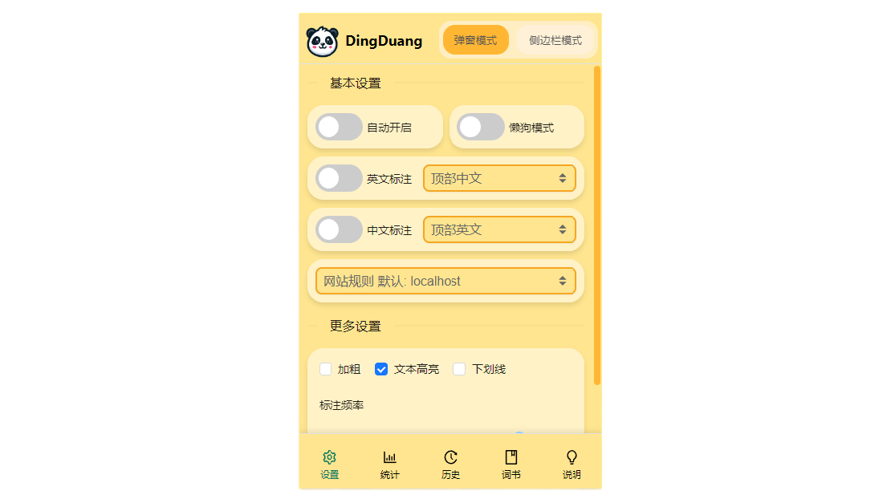
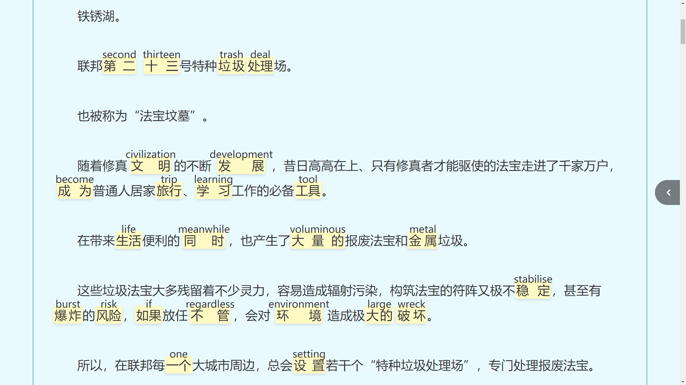
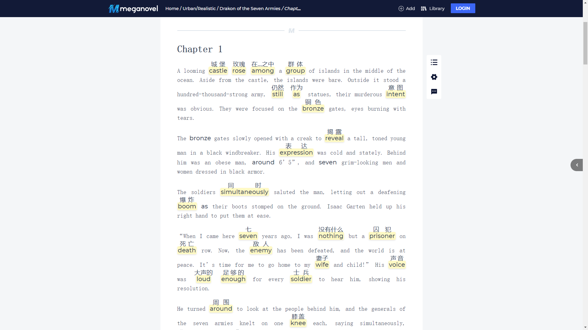
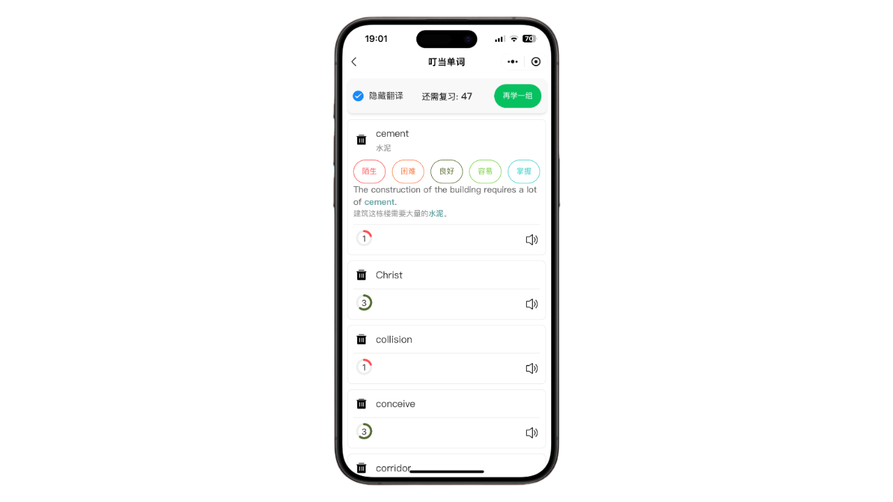
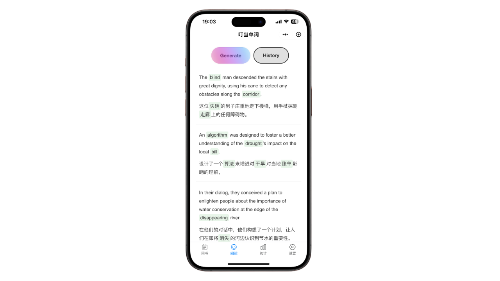
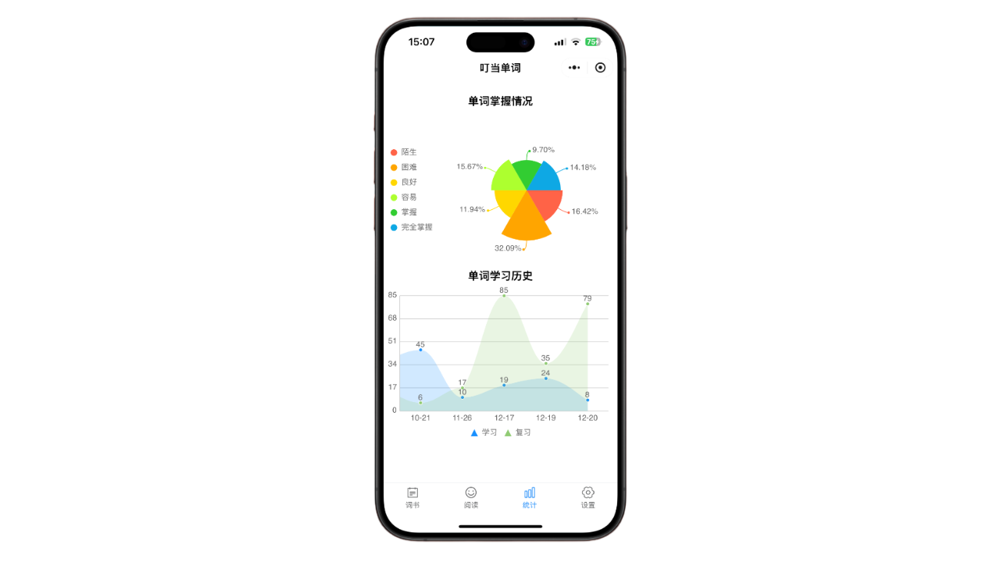

<h1>叮当单词 Chrome 扩展</h1>

## 目录

- [介绍](#介绍)
- [功能](#功能)
- [截图](#截图)
- [安装](#安装)

## 介绍 

这是一个 Chrome 扩展，用于在浏览器阅读小说文章时对所学的单词进行标记。
> 目标是帮助用户在阅读小说文章时顺带背单词。

## 功能 
- 中文标注
  - 在浏览中文文章时候，会标注你的单词表（如四级词汇）中的单词。
- 英文（日文……后期可能会扩展其他语言）标注
  - 在浏览英文文章时候，会标注你的单词表（如四级词汇）中的单词。
- 懒狗模式
  - 懒狗模式下的单词，翻译只选用最常用的释义，以便能更轻松的快速记忆。
- 小程序
  - 提供一个小程序，方便用户在手机上学习和复习。
  - 小程序：[https://github.com/woniu9524/dingdang-miniprogram](https://github.com/woniu9524/dingdang-miniprogram)
  - 

## 截图 

#### 插件截图

#### 插件使用效果截图

#### 小程序截图

## 安装 
- [Chrome 浏览器商店安装](https://chromewebstore.google.com/detail/%E5%8F%AE%E5%BD%93%E5%8D%95%E8%AF%8D/clifanofjpkhkekkfkdcnhiiccobepki?hl=zh-CN)
- Edge 浏览器商店安装
- [直接下载安装](https://github.com/woniu9524/dingdang-extension/releases/)

---

感谢您的使用，希望您喜欢！
